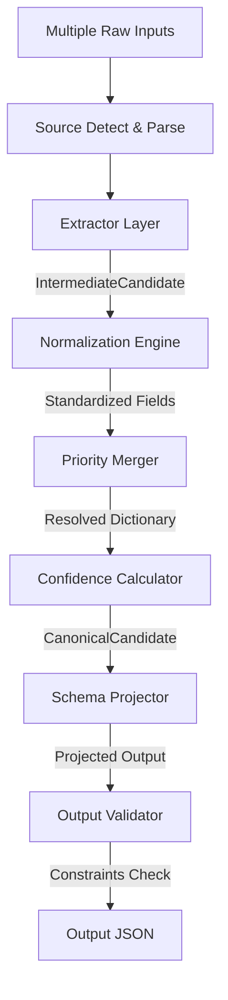

# Stage-1 Design Document: Multi-Source Candidate Data Transformer

This document details the architectural specifications and design considerations for the Candidate Profile Transformation Engine.

---

## 1. System Architecture

The transformer executes a clean pipeline architecture:

- **Extraction**: Maps inputs to a common schema (`IntermediateCandidate`). If files are corrupt or empty, parser logs errors and falls back gracefully to empty entities.
- **Normalization**: Translates field strings into standardized values. Utilizes `phonenumbers` for E.164 phone parsing, `dateutil` for fuzzy dates to `YYYY-MM`, and `rapidfuzz` (threshold 85) for skill mapping to canonical keys, avoiding partial match errors (e.g. preventing "JavaScript" from incorrectly mapping to "Java").
- **Merging**: Consolidated matching entities. Dedups flat lists and merges complex collections (overlapping work and school durations are consolidated attribute-by-attribute).
- **Confidence**: Computes a single profile score based on individual field confidences. Missing fields receive 0.0, naturally penalizing incomplete profiles.

---

## 2. Canonical Candidate Schema

All models inherit from Pydantic V2 `BaseModel` to enforce type constraints:

- **`Provenance`**:
  - `field`: `str`
  - `source`: `str`
  - `method`: `str`
  - `timestamp`: `datetime` (defaults to current UTC time)
- **`FieldMetadata[T]`** (Generic):
  - `value`: `T`
  - `confidence`: `float` (0.0 to 1.0)
  - `provenance`: `Provenance`
- **`WorkExperience`**:
  - `company`: `str` (fuzzy matched)
  - `title`: `Optional[str]`
  - `start_date`: `Optional[str]` (YYYY-MM)
  - `end_date`: `Optional[str]` (YYYY-MM, or 'Present')
  - `description`: `Optional[str]`
- **`Education`**:
  - `institution`: `str` (fuzzy matched)
  - `degree`: `Optional[str]`
  - `major`: `Optional[str]`
  - `start_date`: `Optional[str]`
  - `end_date`: `Optional[str]`
- **`CanonicalCandidate`**:
  - `candidate_id`: `str` (generated UUID)
  - `full_name`: `Optional[FieldMetadata[str]]`
  - `emails`: `List[FieldMetadata[str]]` (deduplicated)
  - `phones`: `List[FieldMetadata[str]]` (deduplicated E.164)
  - `location`: `Optional[FieldMetadata[str]]`
  - `links`: `List[FieldMetadata[str]]`
  - `headline`: `Optional[FieldMetadata[str]]`
  - `years_experience`: `Optional[FieldMetadata[float]]`
  - `skills`: `List[FieldMetadata[str]]` (deduplicated canonical skills)
  - `experience`: `List[FieldMetadata[WorkExperience]]`
  - `education`: `List[FieldMetadata[Education]]`
  - `provenance`: `List[Provenance]` (aggregated unique history)
  - `overall_confidence`: `float`

---

## 3. Merge & Conflict Resolution Strategy

- **Scalar Fields**: Sorted by priority scale `ATS > CSV > PDF > TXT`. If values differ, the highest priority *valid, non-empty* value is selected. Ties are broken by confidence scores.
- **Deduplication**:
  - **Emails**: Normalized to lowercase, stripped. Unique keys hold the metadata from the highest-priority source.
  - **Phones**: Normalized to E.164 format.
  - **Skills**: Fuzzy matches mapped to the canonical dictionary using `rapidfuzz` (threshold 85).
- **Work Experience / Education**:
  - Checks if company or school matches using fuzzy matching (ignoring corporate suffixes like "Inc.", "Corp." or school terms like "University").
  - If overlapping or close durations represent the same job/school, we merge them attribute-by-attribute. The highest priority source forms the base, and missing fields (e.g. description) are filled from lower priority sources.

---

## 4. Confidence Strategy

Confidence scores are assigned dynamically:
- **Base Confidences**:
  - ATS import: `0.99`
  - Recruiter CSV: `0.95`
  - PDF Resume Regex: `0.78`
  - TXT notes regex: `0.70`
- **Overall Confidence**:
  - Evaluated using a weighted sum of present fields:
    - `full_name`: 25%
    - `emails`: 20%
    - `phones`: 15%
    - `experience`: 15%
    - `education`: 10%
    - `skills`: 8%
    - `location`: 3%
    - `headline`: 2%
    - `years_experience`: 2%
  - Since weights sum to `1.0`, any missing field (treated as `0.0` confidence) naturally decreases the overall profile confidence score, acting as a profile completeness check.

---

## 5. Edge Cases Handled

| Edge Case | Solution |
| :--- | :--- |
| **Corrupted PDF** | Wrapped inside a try-catch block; logs warning and returns an empty profile to continue merging remaining sources. |
| **Invalid JSON** | Skipped with logs; continues execution. |
| **Empty Resume** | Ingested as an empty candidate profile, generating a warning. |
| **Duplicate Emails/Skills** | Consolidated under the highest-priority source's metadata. |
| **Conflicting Names** | Resolved using `ATS > Recruiter CSV > Resume > Notes`. |
| **Unknown Skills** | Preserved to prevent data loss, formatted to Title Case (or uppercase if under 4 letters). |
| **Fuzzy Date Formats** | Parsed via `dateutil` with a deterministic default datetime (Jan 1st), ensuring consistent outputs. |
